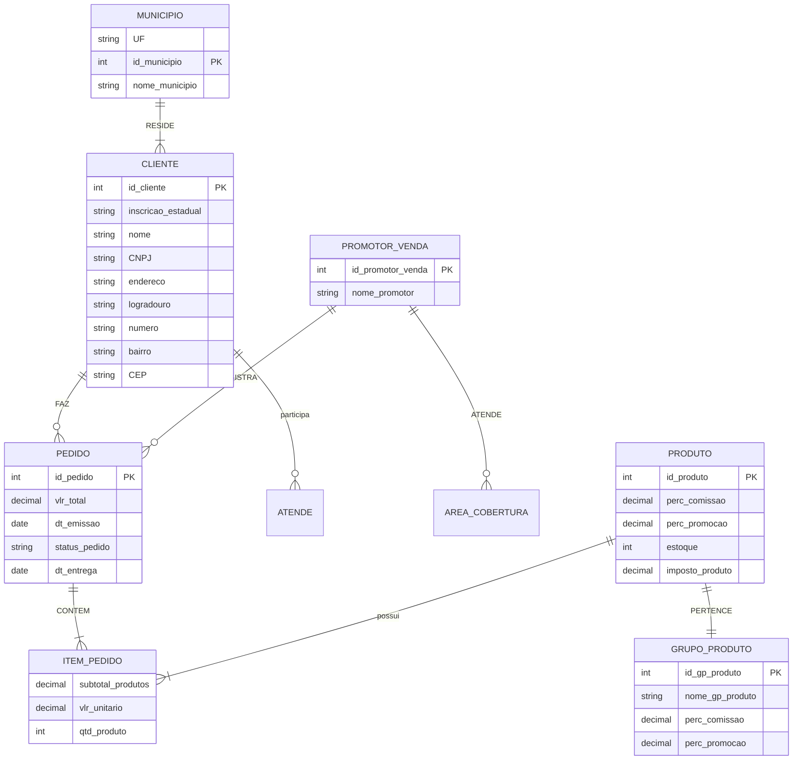

# SisVenda - Sistema de Vendas 

Este repositório contém a documentação e o desenvolvimento do sistema proposto na disciplina **Análise e Projeto de Sistemas Computacionais**, no período 2025/1.

## 📑 Índice

- [🏢 Visão Geral](#-visão-geral)
- [📘 Story](#-story)
- [🧩 Modelo Conceitual DER](#-modelo-conceitual-der)
- [🔷 Modelo Conceitual Orientado a Objetos (OO)](#-modelo-conceitual-orientado-a-objetos-oo)
- [🗂️ Diagrama de Casos de Uso](#-diagrama-de-casos-de-uso)

---
## 🏢 Visão Geral
A **Empresa X** atua no setor de vendas de materiais eletroeletrônicos por meio de **catálogos impressos**, distribuídos via correio com o apoio de uma equipe de **promotores de venda**. Esses promotores visitam clientes em suas respectivas **áreas de cobertura (municípios)** com o objetivo de divulgar produtos, registrar pedidos e, assim, aumentar suas comissões — calculadas com base no volume de compras dos clientes.

O sistema tem como objetivo **automatizar e gerenciar** esse processo, desde o **cadastro de promotores, clientes e produtos**, até o **registro, avaliação, entrega e acompanhamento de pedidos**. Ele também fornece **relatórios** para o controle de vendas, estoques e comissões.

A operação se dá da seguinte forma:

 1. **O promotor de vendas** visualiza sua lista de clientes, registra novos pedidos e acompanha suas comissões.

 2. **Os pedidos realizados** são enviados à empresa, onde passam por:
   - **Verificação de estoque** feita pelo gerente de estoque.
   - **Análise financeira do cliente** realizada pelo gerente de vendas, que aprova ou cancela o pedido.
   - Em caso de aprovação, é feita a **programação da entrega**, com reserva e baixa do estoque.
   - No dia da entrega, o pedido é **processado e finalizado**.

 3. **Os clientes** podem acompanhar seus pedidos e recebem notificações sobre o andamento.

 4. **Os gerentes de vendas e de estoque** têm acesso a **relatórios detalhados** para controle e tomada de decisões.
 
---
## 📘 Story

As histórias de usuário (User Stories) do sistema estão detalhadas no arquivo [user-storys.md](document/user-storys.md). Lá você encontrará a descrição completa das funcionalidades do sistema na perspectiva dos diferentes usuários:

- Promotor de vendas
- Cliente
- Gerenciador
- Gerente de estoque
- Gerente de vendas

---

## 🧩 Modelo Conceitual DER

> Apresente aqui o Diagrama Entidade-Relacionamento (DER), que representa a modelagem dos dados do sistema.

### Modelo Conceitual

### Modelo Lógico

---

## 🔷 [Modelo Conceitual Orientado a Objetos (OO)](https://lucid.app/lucidchart/3ab6d960-81c9-46d6-b9e2-7b98e5dd0f45/edit?viewport_loc=-769%2C-109%2C3511%2C1748%2COaRhBAe6IYM9&invitationId=inv_eaf0bf03-8ad6-41cd-bfa8-1bc1b8b04ea0)

> Apresente o modelo conceitual orientado a objetos, com foco nas classes principais, atributos e relacionamentos.

### Pode incluir:
- Diagrama de classes UML (imagem)
- Descrição das classes e responsabilidades
- Heranças, associações e composições
- Comentários sobre a coesão e acoplamento

---

## 🗂️ Diagrama de Casos de Uso

> Apresente o(s) diagrama(s) de casos de uso que descrevem como os usuários interagem com o sistema.

### Sugestões:
- Inserir imagem dos casos de uso
- Listar os atores
- Descrever cada caso de uso brevemente (em formato de tabela ou lista)

---